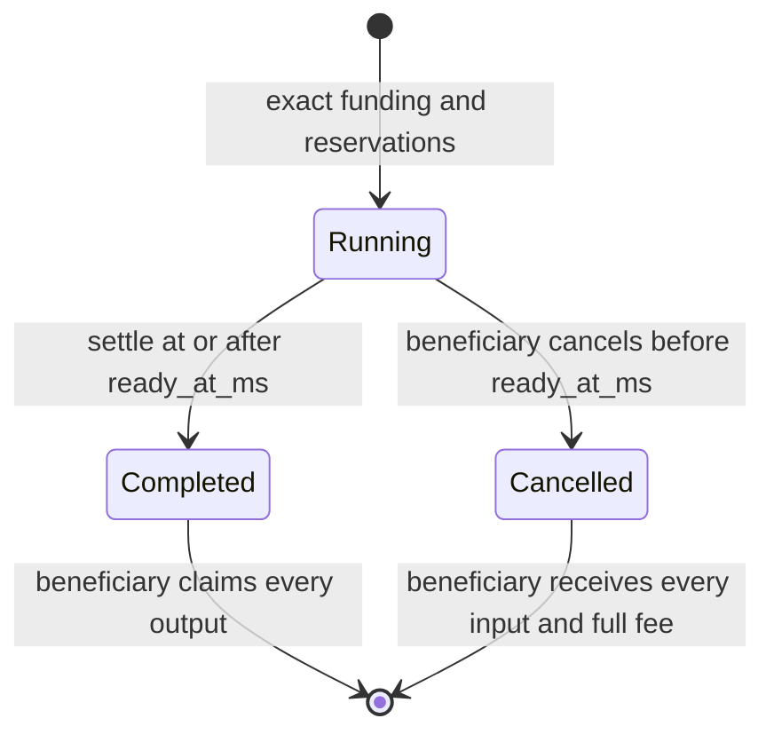

# Unified industry

`inventory::industry` implements refining and manufacturing as recipe categories
in the same installed `Module<Industry>`. Each recipe has independent input and
output arrays: `1 → 1`, `1 → many`, `many → 1`, and `many → many` use the same
start, settle, claim, cancel, and refund operations. Type IDs are `u64` data;
there is no Move generic type or contract deployment per material.

## Modules

| Module | Responsibility |
| --- | --- |
| `item_type` | Admin-governed tenant catalog, immutable canonical volumes and production eligibility, import replay history. |
| `item_v2` | Catalog-bound fungible assets, checked array arithmetic, split/merge/concatenation, distinct production consume/create events. |
| `inventory_v2` | Bulk storage actions, per-type limits, authenticated bridge imports, beneficiary exports and direct recovery. |
| `recipe` | Frozen, versioned recipe revisions and admin-controlled admission enablement. |
| `industry_job` | Package-private escrow, timing, exact funding, output creation, fee and refund transitions. |
| `industry` | Facility installation, access, policy, shared lanes/capacity, job custody and protected lifecycle. |

The six modules live in the existing inventory package. Legacy `Item` and
`StorageInventory` APIs remain separate. Industry accepts only `ItemV2`; there is
no unverified wrapping of legacy assets. New industry assemblies require
[Entity V2](../core/ENTITY_V2.md).

## Bootstrap and authority

1. Publish the upgraded core and dependent inventory package to an isolated
   environment. New Entity objects have version 2 and a complete module index.
2. An existing core AdminACL administrator creates an `ItemTypeRegistry` for a
   tenant. Register immutable positive type IDs, positive integer unit volumes,
   and production eligibility. The registry pins this exact ACL object.
3. Create a `RecipeRegistry` bound to that item catalog. Publish frozen revisions
   with strictly increasing type IDs on each side, facility types/tier, kind,
   maximum batches, and milliseconds per batch. `0` means refining; `1` means
   manufacturing. Publishing a revision enables it for new starts.
4. Install V2 storage and industry on an Entity in that tenant. Installation
   checks the pinned ACL internally and returns the ordinary core admin Request,
   which the transaction must also approve and complete.
5. The owner exposes start/storage actions. Their `Start` and bulk inventory
   requirements impose batch/per-type ceilings. Industry additionally enforces
   canonical recipe approval, actual asset provenance, AccessCap identity,
   facility type/tier/kinds, owner policy, fees and capacities inside its handler.

Facility input/output allocations are separate from storage capacities. The
administrator must allocate them from the actual facility budget; these contracts
do not know the physical cargo or power budget of a game assembly.

The default policy is owner-only with no fee. The owner can enable customer
service, pause new starts, narrow recipe/kind eligibility, and set a SUI fee per
batch. A caller supplies `max_fee`; the contract rejects a greater charge. The
job records its beneficiary principal, complete material arrays, duration, fee,
and fee recipient when funded. Subsequent policy changes cannot alter these terms.

## Transactions and arrays

```text
source action → withdraw_many → complete source Request
  [repeat for another source; concatenate returned vectors]
industry action → start_job(inputs, recipe, batches, max_fee) → complete Request
settle_job(job_id) → claim_outputs(job_id) → vector<ItemV2>
destination action → deposit_many(products) → complete destination Request
```

For zero-duration recipes, the entire sequence can be one programmable
transaction block (PTB). A failed last deposit rolls back withdrawals, supply
changes, job transitions, and fees. Gas still applies. Requests on the same Entity
must be sequential because Entity locks prevent overlapping interactions.

Inputs are actual assets, not declared quantities. All supplied stacks are
aggregated by type and must match the complete recipe exactly after multiplication
by batch count. Missing, extra, excessive or mismatched assets abort. Multiple
stacks of the same type are allowed. A type may appear on both recipe sides;
its complete input is still escrowed and consumed. Output array lengths need not
match input lengths; every byproduct is reserved and produced.

A returned `vector<ItemV2>` is one Move return value. Pass it directly to
`deposit_many`, `start_job`, or `item_v2::concat`; do not treat its elements as
separate PTB result indices. `item_v2::transfer_all` delivers the whole vector to
an address. Bulk storage limits apply to each aggregated type quantity, including
fragmented stacks. Use `withdraw_owned` to recover a principal's own inventory
without depending on owner-configured actions.

## Timed custody and capacity



`&sui::clock::Clock` supplies time. A transaction must settle a mature job;
contracts do not wake themselves. Anyone may settle, but products remain in the
job vault for its recorded beneficiary. The prepaid fee is paid to the recorded
recipient at settlement. Cancellation before maturity creates no products;
refund returns the original escrow assets and full fee. Zero-duration jobs
cannot be cancelled. Drained jobs are deleted; final events retain their history.

| Operation | Input usage | Output reservation | Output usage | Running lanes |
| --- | --- | --- | --- | --- |
| Start | Add all input volume | Add all output volume | Unchanged | +1 |
| Settle | Release all inputs | Release reservation | Add all outputs | −1 |
| Claim | Unchanged | Unchanged | Release outputs | Unchanged |
| Cancel | Retain refund volume | Release reservation | Unchanged | −1 |
| Refund | Release input volume | Unchanged | Unchanged | Unchanged |

Completed and cancelled jobs still count against the outstanding-job limit until
claimed/refunded. Refining and manufacturing share the same counters and lanes.
Admin limit reductions cannot fall below existing obligations. Output reservations
cover the industry vault; an external destination may still be full. Combine
claim and deposit in a PTB so failed delivery preserves the claim for retry.

Settlement, claim, cancellation, refund, and owner configuration use fixed
module-authored core Requests. The owner cannot remove these recovery paths by
disabling actions, pausing service, or changing category/fee policy. Claim,
cancel, and refund validate a current AccessCap for the committed principal;
capability transfer follows the existing core access model.

Industry uninstall rejects any outstanding job or accounted assets. V2 storage
uninstall rejects funded buckets. Core V2 deletion requires every installed module
to be removed through its own teardown path. There is no destructive force-delete
or arbitrary admin confiscation operation.

## Bounds

| Limit | Value |
| --- | --- |
| Distinct recipe input types | 32 |
| Distinct recipe output types | 32 |
| Actual input ItemV2 objects | 64 |
| Batches per job | 1,000,000, further limited by recipe/action |
| Facility types per recipe | 32 |
| Concurrent lanes per module | 32 |
| Outstanding jobs per module | 128 |
| Owner recipe allowlist | 128 |

Quantities and volumes use checked `u128` intermediates and must fit `u64`.
There are no fractional yields or efficiency modifiers. Catalog volumes are
integer units chosen by the game operator; synthetic fixtures use test units.
Admission checks total input volume and occupied plus reserved output volume.

## Events and bridge boundary

`IndustryJobStarted`, `IndustryJobCompleted`, `IndustryJobCancelled`,
`IndustryOutputsClaimed`, and `IndustryInputsRefunded` contain a versioned
`JobSummary`: entity/module, tenant, beneficiary, recipe revision ID/digest, kind,
batch count, complete input/output arrays, timing and committed fee.
`ProductionBurned` / `ProductionMinted` identify production changes
with job IDs. They must never be interpreted as off-chain container credits.

`inventory_v2::import_items` requires a transaction signed by a pinned ACL admin.
The transaction binds destination Entity/module, beneficiary and complete amounts
to the catalog and supplied transfer ID. Transfer IDs are nonempty, at most 64
bytes, and consumed once per item catalog; replay history survives storage
uninstall/reinstall. This is a trusted-server transaction boundary: the server
must first attest/debit the real off-chain assets. No generic signed-payload or
expiry-based import permit is implemented.

Exports require the inventory beneficiary's AccessCap, atomically debit balances,
and emit `GameItemsExported` with a unique export ID and full amounts. The game
operator must consume finalized export events idempotently and credit that
beneficiary exactly once. No game database adapter is included here. Index by
chain ID, transaction digest and event sequence; reconcile job IDs and transfer
IDs at the domain level. Retrying a transaction must not create a second game
credit or a new debit for an already imported transfer.

## SDK and local verification

The SDK exports unified industry and V2 inventory transaction builders, exact
bigint quote math, recipe/job BCS schemas and read helpers, lifecycle event
decoders, and synthetic fixtures. JSON helpers serialize bigint values as decimal
strings. See the [SDK README](../../sdk/world-sdk/README.md) and
[industry integration tests](../../sdk/world-sdk/src/__integration__/industry.test.ts)
for executable PTB composition. The checkout has no active Move PTB discovery
module; the SDK supplies the concrete transaction templates.

`seed:industry` creates an explicitly synthetic tenant/catalog, recipe examples
of every cardinality, V2 storage, actions and a dual-category Industry module.
`scripts/seed-world.sh` includes this step only for localnet. Real recipe rates,
type IDs, volumes, facility IDs and allocations must be provided by the operator.

Run Move tests with `sui move test --build-env testnet --path contracts/core` and
`sui move test --build-env testnet --path contracts/inventory`. Run SDK unit tests with
`pnpm --filter @evefrontier/world-sdk test`. The integration suite requires a
fresh local core/inventory deployment manifest at `deployments/localnet/world.json`,
an authorized local `SUI_PRIVATE_KEY`, and optionally `SUI_GRPC_URL`/`SUI_RPC_URL`
for a nondefault endpoint. These tests use local gas and synthetic inventory.

Validation on 2026-09-04 used Sui CLI `1.79.0-46f18562f1f5`: 80 core, 98 inventory,
6 character, 5 metadata and 5 currency Move tests passed. Core and inventory also
passed against the repository's original `testnet` framework pins. The SDK's
9 unit tests and both localnet integration scenarios passed, including the full
32-input-type/64-stack to 32-output-type conversion in one PTB. These are local
correctness and feasibility checks, not a live-network gas guarantee.
The maximum fixture used 300 PTB commands and 275,948,428 MIST net gas on that
local network. SDK source/script type checks, build and scoped Biome checks passed;
the separate workspace `ts-scripts` check still reports an unrelated type error
in the unchanged `ts-scripts/clear-published.ts:24`.

## Live adoption requirements

This implementation supplies the on-chain engine and local integration. It does
not provide real game data, signed physical proximity/state proofs, continuous
powered-work accounting, a game reconciliation service, or an existing-lineage
migration. The current core proximity handler compares hashes and is suitable
only for the existing prototype access flow. Fuel can be an explicit recipe
input under the upfront-consumption model; elapsed time alone does not prove a
facility stayed powered. There is no blueprint-license/unique-asset manufacturing
or destruction recovery protocol.

Use fresh Entity V2 objects and authenticated V2 stock for initial adoption.
Historical V1 code remains callable on V1 objects; package upgrades cannot remove
it. No V1 entity/item migration is claimed safe without a separate verified
provenance and complete-module-inventory design. Follow the
[original plan](../../docs/plans/industry-contracts-plan.md) for live release gates.
