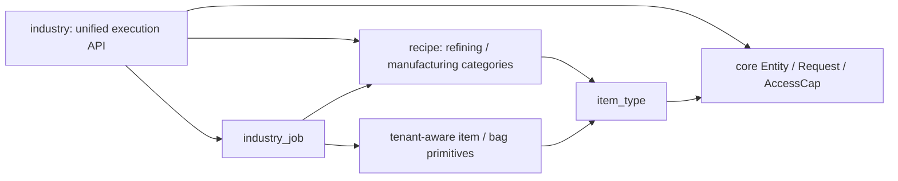

# Unified industry contract: refining and manufacturing

Status: on-chain implementation and synthetic localnet SDK integration completed,
2026-09-04, starting from checkout `b680fba`. The design below records the original
plan; see [the implemented API and deployment boundaries](../../contracts/inventory/INDUSTRY.md)
for current behavior. The implementation includes all six supporting/execution
modules, Entity V2 lifecycle protection, timed jobs, customer service and fees,
bulk storage, SDK builders/readers, fixtures and tests. Live game reconciliation,
physical proofs, authoritative economic data and existing-lineage migration remain
release gates. Only an isolated local test network has been used.

Build industry as a typed `Module<Industry>` installed on a `core::entity::Entity`.
An approved recipe consumes exact quantities of input `type_id`s and produces
exact quantities of output `type_id`s. Refining and manufacturing are recipe
categories within the same industry contract, using one public API, job model,
accounting engine, and custody lifecycle. Recipe data defines their material
requirements, products, duration, and eligible facilities.
Each recipe has an independent input array and output array. The common engine
supports `1 → 1`, `1 → many`, `many → 1`, and `many → many` from its first release.

Expose `inventory::industry` as the unified execution contract, supported by item
type, recipe, and job modules: four source modules in the existing `inventory`
Move package. This keeps production inside the package that already controls item
supply. Refining and manufacturing use this structure throughout the plan.

## 1. What the checkout supports

| Finding | Source | Design consequence |
| --- | --- | --- |
| Active structures use Entity / Module / Action / Request / Requirement. | [ADR 0002](../adr/0002-modular-architecture.md), [entity.move](../../contracts/core/sources/entity.move), lines 149–261 | Use installed modules and `u64 module_id`; names are display labels. Archived `world::StorageUnit` patterns are unsuitable. |
| Items are fungible balances keyed by `type_id: u64`; withdrawal creates a standalone Item. | [item.move](../../contracts/inventory/sources/item.move), lines 1–47, 150–163 | A game type ID is data, not a Move generic type. No new Move type or package is needed for each ore/component. |
| Item supply and bag mutation functions are `public(package)`. | [item.move](../../contracts/inventory/sources/item.move), lines 95–179 | A third-party extension cannot currently implement genuine conversion using the public API alone. |
| Deposit and withdrawal move existing stock. | [inventory.move](../../contracts/inventory/sources/inventory.move), lines 178–211 | An exchange of stocked outputs is different from producing new outputs. |
| Install/uninstall are admin-gated; exposed actions are owner-gated. | [entity.move](../../contracts/core/sources/entity.move), lines 149–225 | Owners choose services, but game authority controls facility eligibility and production rules. |
| Requests and Frames cannot survive a transaction. | [request.move](../../contracts/core/sources/request.move), lines 24–38 | Timed production requires persisted jobs and separate start/finish transactions. |
| Main and ephemeral inventories are implemented; airlocks are proposed. | [inventory.move](../../contracts/inventory/sources/inventory.move), lines 1–19; [ADR 0003](../adr/0003-onchain-inventory-design.md) | Use current storage adapters initially. Do not assume ship airlocks or neutral escrow already exist. |

The source takes precedence over older illustrative examples in the ADRs and
CONTEXT.md, some of which still describe named module targeting or planned inventory.

## 2. Economic and authority boundaries

**Conversion means consumption plus creation.** Never expose
`convert(from_type, to_type, output_quantity)` with caller-selected outputs. The
caller supplies a trusted recipe reference and a batch count; contracts derive
all quantities, volumes, duration, and permitted facility classes.

The MVP covers fungible items. Assembled ships, individually identified assets,
durable blueprint objects, and assets with unique attributes need separate
constructors and lifecycle rules; do not manufacture them by adding a fungible
balance of the same type ID.

| Actor | Authority |
| --- | --- |
| Game/admin | Register canonical item types and recipe revisions; attest eligible facility modules, capacities, lanes, and tiers; manage upgrades and emergency policy. |
| Assembly owner | Expose actions; restrict approved recipes further; pause new work. Later, choose permitted access policy and bounded service fees. |
| Job beneficiary | Supply items; start allowed jobs; claim products or refunds; cancel under the committed policy. |
| Any transaction submitter | Optionally settle a mature job, with products remaining assigned to its recorded beneficiary. |
| Builder extension | Compose approved handlers and add service rules. It receives no general mint, burn, recipe-registration, or rate-editing authority. |

Industry handlers enforce mandatory rules internally even if the owner exposes an
action that omits optional access, fee, or approval requirements. Bind privileged
configuration to the expected AdminACL/catalog object IDs; accepting an arbitrary
object with an appropriate-looking type is insufficient.

The first useful slice is owner-operated industry with one lane, fixed integer
recipes from both categories, no service fee, and zero-duration jobs. Multi-party
services follow once principal identity and recovery paths are exercised.

## 3. Unified industry contract structure

The four new source modules below initially live in
`contracts/inventory/sources/`. They publish under the inventory package address.
`industry.move` owns the assembly-facing execution API; the other three organize
shared state and validation used by every industry recipe.

| Order | Module | State and responsibilities |
| --- | --- | --- |
| 1 | `item_type.move` | Governed `ItemTypeRegistry`; tenant-scoped type ID, canonical integer unit volume, fungibility/production eligibility. Validate types and volumes used by bridges and production. |
| 2 | `recipe.move` | Governed `RecipeRegistry` plus immutable `RecipeRevision` objects. Define process kind, independent bounded input/output arrays, supported facility types/tier, batches, duration, and schema version. Disable new starts without rewriting accepted jobs. |
| 3 | `industry_job.move` | Persisted `IndustryJob`, full input/output commitments, input escrow, output/refund vault, and package-private state transitions. Only a fully funded job can consume its complete input array and create its complete output array. |
| 4 | `industry.move` | One installed `Industry` state and execution API for refining, manufacturing, and supported future recipe categories. Own install/configuration and start/settle/claim/cancel/refund handlers; enforce identity, recipe/facility eligibility, capacity, lanes, and lifecycle safety. |

Refining and manufacturing are represented by `RecipeRevision.kind`. Both call
`industry::start_job` and use the same requirement types, `IndustryJob` records,
escrow, output/refund vaults, and settlement code. Category labels can organize the
UI and restrict facility/service policy. Input/output cardinality, duration,
yield, and resource rules come from the approved recipe, so a category does not
implicitly mean single-input, instantaneous, or a different creation authority.

An admin-configured Industry module can support one or both categories. A module
supporting both uses the same lane pool, outstanding-job limit, and capacity
counters across all its jobs. Facility restrictions and owner-selected subsets
are checked inside the common start handler. Blueprint licenses/catalysts can
later extend the common recipe requirement model with explicit locking rules.

Dependency direction, where an arrow means “uses”:



Keep imports acyclic. Storage and item primitives must not import industry.
`industry` owns the Start/Settle/Claim/Cancel/Refund requirement types and their
constructors/handlers for every category. Read the process kind from the trusted
recipe revision and enforce it against the installed facility's approved kinds;
an action name or caller-supplied label cannot change the recipe category.
The new modules also require supporting changes to item provenance, bridge
authorization/events, lifecycle guards, and SDK adapters, described below.

Keep all new supply-changing helpers private or `public(package)`. If industry
later becomes a separate package, first design an inventory-issued, unforgeable
conversion authorization bound to the registered engine, recipe, entity/module,
tenant, beneficiary, actual consumed inputs, and exact outputs. Merely making
`item::mint` public is not an acceptable extraction strategy.

## 4. Data model and recipe arithmetic

Proposed schemas are design sketches, not claims that these APIs already exist.
Persisted objects carry schema versions; installed state uses the existing
versioned `Module<T>` wrapper. Follow [Move conventions](../move-conventions.md).

**Item types.** Key the registry by `(tenant, type_id)`. Choose a documented integer
volume scale from authoritative game data. Volume for an existing fungible type
is immutable during the initial release; changing it requires a balance/capacity
migration. Reject unregistered types and non-fungible production outputs.

**RecipeRevision.** Store a unique ID, logical recipe ID, revision number, tenant,
kind, canonical `inputs` and `outputs` vectors of `(type_id, quantity_per_batch)`,
allowed facility module type IDs, minimum tier, maximum batches, and milliseconds
per batch. Publish a new revision for any economic change. Registry membership
establishes provenance; a digest alone does not establish approval.
Use one recipe registry and one revision schema for both categories. `kind` is a
validated process category such as `Refining` or `Manufacturing`; it does not
select a separate execution contract.

**Industry.** Store the admin-attested facility module type ID, tier, allowed
process kinds, canonical registry IDs, lane count, pause policy, input/work and
output capacity allocations, used/reserved counters, and an indexed bounded job
collection. Bind it to its installation Entity and numeric module slot. A generic
module containing a familiar type ID is not sufficient eligibility evidence.
The owner's recipe/category allowlist can only narrow the admin-attested facility
capabilities. All supported categories consume the module's shared reservations
and lane limits, preventing category switching from bypassing occupied capacity.

**IndustryJob.** Store a unique job ID, schema version, Entity ID, module ID,
tenant, immutable recipe reference/digest, authenticated beneficiary principal ID,
batches, exact input/output commitments, start/ready timestamps, committed resource
and fee terms, status, and escrow/vault state. Snapshot the accepted terms so later
owner configuration cannot change a customer's job. Persist jobs under Industry;
they are not freely transferable bearer claims.

For batch count `b`:

```text
input_required[t] = recipe.input_per_batch[t] * b
output_created[t] = recipe.output_per_batch[t] * b
ready_at_ms = start_ms + recipe.duration_ms_per_batch * b
```

Start with exact integer recipes and no efficiency modifiers. Reject zero batches,
zero lines, empty input/output sets, duplicate type IDs within either vector,
unknown types, excess/missing input quantities, out-of-bounds vectors/batches, and
overflow. Multiple Item objects of one type may be aggregated before comparing to
the recipe. A type may appear on both sides when deliberately authorized by the
recipe; the entire input is still required before producing output.

Use wide checked intermediates and explicit range checks before narrowing to
`u64`; never silently truncate. Do not equate conserved item count or volume with
recipe correctness. Refining can shrink volume and manufacturing can expand it.
If rational yields are added later, define rounding once per job and test split
batches against combined batches.

Illustrative fixtures only; these are not verified EVE Frontier type IDs or rates:

| Recipe | Per-batch inputs | Per-batch outputs | Two batches |
| --- | --- | --- | --- |
| Refining R1 | `100 × ORE_A` | `70 × MINERAL_B + 20 × MINERAL_C` | Consume 200 ore; produce 140 B and 40 C. |
| Manufacturing M1 | `10 × MINERAL_B + 5 × MINERAL_C` | `1 × COMPONENT_D` | Consume 20 B and 10 C; produce 2 components. |

Actual type IDs, rates, and eligible assembly module types must be imported from
an authoritative game dataset or supplied configuration. None were established by
this repository review.

### 4.1. Array-to-array processing contract

The arrays describe one recipe transformation. They are independent: input line
`i` does not map to output line `i`, and their lengths need not match. Every input
line must be funded to create every output line. Byproducts are ordinary output
lines with the same custody and capacity guarantees as the primary product.

Use arrays of structured entries rather than parallel arrays of IDs and amounts.
This avoids mismatched `type_ids`/`quantities` lengths. Proposed Move value schemas:

```move
// In recipe.move: governed quantities for one batch.
public struct RecipeLine has copy, drop, store {
    type_id: u64,
    quantity_per_batch: u64,
}

// In the tenant-aware item foundation: quantities used by jobs and bulk storage.
public struct ItemAmount has copy, drop, store {
    type_id: u64,
    quantity: u64,
}

// Fields on RecipeRevision:
// inputs: vector<RecipeLine>
// outputs: vector<RecipeLine>

// Fields on IndustryJob, scaled once at start:
// committed_inputs: vector<ItemAmount>
// committed_outputs: vector<ItemAmount>
```

The containing recipe/job supplies the tenant; actual Item objects must all match
that tenant. `ItemAmount` belongs in the item foundation so bulk storage handlers
can use it without importing recipe or industry modules. Getters, constructors,
and versioned containing objects follow repository conventions; these snippets
only specify the array entries.

**Registration and matching rules:**

1. Store each recipe side in strictly ascending `type_id` order. Admin tooling can
   sort before submission; the contract rejects unsorted or duplicate recipe
   lines, empty arrays, and nonpositive amounts. Hash a versioned BCS structure
   containing both labeled arrays, tenant, kind, and all other economic terms.
2. The caller supplies actual `vector<ItemV2>` assets, not just an array of claimed
   balances. Accept their order independently of recipe order. Multiple stacks
   of the same type are valid: aggregate their quantities with checked arithmetic
   after verifying tenant, canonical volume, and positive quantity on each asset.
3. Compare the entire aggregated input set with the scaled recipe input set.
   Require exact type membership and exact quantity for every line. Missing
   inputs, unrelated extra types, and excess quantities abort the start. Withdraw
   exact amounts from storage; a caller holding a larger standalone stack needs
   a supply-preserving split helper, leaving the remainder outside the job.
4. If a type appears on both sides, require its full input quantity in escrow.
   Do not subtract promised output from the funding requirement. Reusable
   catalysts/blueprints remain a separate future lock/return model.
5. Determine products exclusively from the approved output array and batch count.
   Players cannot supply a replacement output vector, choose only valuable lines,
   or omit waste/byproducts to evade capacity limits.

For supplied stacks `S`, recipe inputs `I`, recipe outputs `O`, and batches `b`:

```text
provided[t] = sum(stack.quantity for stack in S where stack.type_id == t)
required[t] = b * I[t].quantity_per_batch
produced[t] = b * O[t].quantity_per_batch

require keys(provided) == keys(required)
require provided[t] == required[t] for every required type

V_inputs  = sum(required[t] * canonical_volume[t] for t in inputs)
V_outputs = sum(produced[t] * canonical_volume[t] for t in outputs)
```

Check multiplication, same-type stack aggregation, and total volume accumulation
for overflow. Per-type limits apply to aggregated quantities; splitting one type
across many objects cannot bypass a maximum.

**Concrete many-to-many fixture:** the numeric IDs below are synthetic test data.

```text
inputs  = [{type_id: 1001, quantity_per_batch: 100},
           {type_id: 1002, quantity_per_batch: 40}]
outputs = [{type_id: 2001, quantity_per_batch: 60},
           {type_id: 2002, quantity_per_batch: 25},
           {type_id: 2003, quantity_per_batch: 5}]
batches = 3

committed_inputs  = [(1001, 300), (1002, 120)]
committed_outputs = [(2001, 180), (2002, 75), (2003, 15)]
```

Supplying stacks `[(1002, 120), (1001, 100), (1001, 200)]` funds that job exactly.
Supplying `[(1001, 300), (1002, 119)]` creates no job or products and commits no
input withdrawal in a combined PTB. Every output belongs to the committed
beneficiary, including type 2003; a service fee is a separately committed term.

**Bounded, atomic arrays:** introduce distinct limits for input type count, output
type count, supplied Item object count, and batches. Enforce limits in registration
and job admission before expensive processing; settlement/claim/refund use the
job's admitted schema limits. Lowering a limit affects new jobs and must not strand
an existing job's output or refund array. Set initial limits by measuring the
complete PTB, including storage adapters, events, and worst-case new balance
creation. Check `limit`, `limit + 1`, and maximum simultaneous array sizes in tests;
do not treat a network transaction limit as a safe application default.

For the initial release, fund all inputs in one start transaction and settle all
products in one settlement transaction. No partial funding, subset output claims,
or paged settlement. A failure on the final array element rolls back that entire
transaction. Size admitted jobs so settlement and full output/refund delivery fit
within the transaction budget; never accept a job whose products cannot be claimed.

Claims return one Item per output type, in canonical order. Refunds return the
complete committed input amounts and preserve tenant/volume provenance; same-type
stacks may be consolidated into fresh Item objects. Refunding does not promise
the original object IDs or stack boundaries, since the items are fungible.

## 5. Inventory integration and atomic execution

Give Industry its own bounded job escrow and output/refund vaults. These are new
contract-controlled storage areas, charged against trusted facility capacity
allocations. They must not grant a second unaccounted copy of a structure's cargo
capacity. Ordinary inventory remains the source/destination adapter.

This avoids trying to borrow `StorageInventory` and `Industry` through the same
next requirement: `entity::module_mut` targets only the module ID on that
requirement. It also prevents an owner-configured general withdrawal action from
spending materials already committed to someone else's job.

**Start PTB:**

1. Interact with the source storage action, satisfy its access/proximity rules,
   withdraw the exact input array as Item objects, and complete that Request.
2. Interact with the industry action. Resolve proximity and authenticate the
   principal; the industry handler checks the AccessCap itself or consumes a
   mandatory authenticated proof, rather than relying only on an optional Caller
   requirement supplied by the owner.
3. While the Industry requirement is still next, borrow its module. Then consume
   the typed requirement, decode its constraints, and validate the trusted recipe,
   facility, tenant, batch bounds, inputs, and capacity.
4. Reserve a lane and output space; move actual input items into job escrow;
   persist the job; emit `IndustryJobStarted`; complete the industry Request.

**Bulk storage adapters:** add `BatchWithdrawal` and `BatchDeposit` requirements
and `withdraw_batch`/`deposit_batch` handlers to the tenant-aware inventory API.
Each requirement binds one target module, one authorized inventory bucket, and a
bounded policy for allowed types and aggregate per-type quantity limits. Requested
withdrawal amounts are a canonical `vector<ItemAmount>` handler argument; deposit
amounts are derived from the supplied assets. Enforce every aggregated line against
the stored policy and validate the total capacity delta, consume the batch
requirement once, and finish its Frame normally. Exact preset amounts can be an
optional stricter policy. Actions store fixed requirements, so baking one exact
batch's quantities into every action would otherwise require reconfiguration for
each requested batch count. The industry handler independently requires an exact
match to its recipe. Existing scalar deposit/withdraw handlers each consume their
own requirement; they cannot share a single already-consumed requirement in a loop.

The intended value flow is:

```text
withdraw_batch(...) -> vector<ItemV2>
start_job(..., inputs: vector<ItemV2>, batches, ...) -> job_id
settle_job(..., job_id, ...) -> products held in job vault
claim_outputs(..., job_id, ...) -> vector<ItemV2>
deposit_batch(..., outputs: vector<ItemV2>, ...) -> all products in storage
```

These are proposed interfaces; normal entity/request, catalog, access, and Clock
arguments still apply. `claim_refund` uses the same vector delivery path. A vector
returned by a Move call is one PTB result; consume it with a Move vector-handling
adapter rather than assuming each element is a separately addressable command
result. A beneficiary delivery helper can instead transfer every returned Item
in Move. No helper may drop or leave an output unaccounted for.

Initially deposit the full output array into one authorized destination inventory.
Multiple source inventories are allowed through separate authorized withdrawals
combined before start. Add a bounded Move helper to concatenate returned Item
vectors without minting, copying, or dropping assets; a client must not pass whole
vectors to an Item-vector constructor as though they were individual Items. Later
multi-destination routing must account for every
output exactly once, validate each destination, and remain atomic; it is not
needed to support multiple output types.

The source and processor may be the same Entity, but their Requests must be
sequential: the core lock does not permit overlapping interactions on that Entity.
Separate Entities can be included in the same PTB with independently verified
access. An abort rolls back all application changes in the PTB; transaction gas
still applies. [Sui PTB semantics](https://docs.sui.io/develop/transactions/ptbs/prog-txn-blocks)
support this composition.

For the zero-duration industry MVP, start, settle, claim, and destination deposit
can run sequentially in one PTB, each completing its Request. A full destination
then rolls back the whole conversion. For timed jobs these are separate PTBs;
destination fullness must leave products safely claimable for a later retry.

The handler API surface should include `install`, `start_job`, `settle_job`,
`claim_outputs`, `cancel_job`, `claim_refund`, `set_policy`, `uninstall`, and matching
requirement constructors/read helpers. Public input parameters select a recipe,
batch count, job ID, or action policy; they never prescribe output quantities.
Both refining and manufacturing call these same handlers. Assembly action names
may distinguish offered services, but each action ultimately invokes the common
industry requirements and engine.

**Protect accepted jobs from action removal.** The owner can currently disable or
replace any exposed action. Start remains owner-configured, but settlement,
claim, cancellation, and refund must also have a module-authored lifecycle path
that the owner cannot remove or attach new fees to. Add a generic core helper,
conceptually `begin_module_request<T>(entity, module_id, requirement, Permit<T>)`,
which checks Entity version, installed module type, unlocked state, and matching
requirement module ID before locking and creating a Request. Only the package
authoring the installed module can obtain its permit.

Industry uses that helper only with its own fixed lifecycle requirements and
completes each Request inside the corresponding public operation. It accepts no
caller-supplied requirement vector. Those operations still enforce job state,
beneficiary cap/version, and any game-required proof internally. This is a new
core API: the current package-private Request constructor does not permit it.
Keep the lifecycle path available after owner policy changes, recipe deactivation,
and removal of every ordinary industry action.

## 6. Timed jobs, custody, and capacity

```mermaid
stateDiagram-v2
  [*] --> Running: validate and escrow inputs
  Running --> Completed: settle after ready_at; consume once and produce once
  Completed --> Claimed: beneficiary collects all outputs
  Running --> Cancelled: beneficiary cancels before ready_at
  Cancelled --> Refunded: beneficiary collects original inputs
  Claimed --> [*]
  Refunded --> [*]
```



Recommended initial policy:

- Start reserves all required inputs and output volume. No work queue initially;
  reject starts when all lanes are occupied. Bound outstanding jobs as well as
  running jobs so unclaimed outputs cannot grow the collection without limit.
- `settle_job` reads `&sui::clock::Clock` and requires `now >= ready_at_ms`. It
  atomically burns escrow as production input, creates the committed output
  balances, marks Completed, and releases the lane. It cannot settle twice.
- Time makes a job eligible; a transaction still has to call settlement. A client
  or keeper can do so. Do not imply that a contract wakes itself at the deadline.
- Read Sui's shared Clock by immutable reference; do not trust a caller timestamp
  or the epoch start time for production duration. See [Sui on-chain time](https://docs.sui.io/sui-stack/on-chain-primitives/access-time).
- Cancellation is beneficiary-authorized and allowed only while Running and
  `now < ready_at_ms`. Return the original escrowed materials through the refund
  path; create no products. Release the running lane and output reservation,
  retaining the outstanding-job slot and input volume until refund. Initially
  there are no service fees. No partial
  production or partial claims in the MVP.
- Any submitter may settle if the action permits it, but settlement only credits
  the job's vault. Claim/refund checks an AccessCap for the committed principal.
  Neither assembly ownership transfer nor the settlement transaction's sender
  changes the beneficiary. The holder of that principal's valid cap can claim;
  losing/transferring a cap follows the existing access system's semantics.
- Owner pause and ordinary recipe deactivation block new starts. They do not
  change or confiscate accepted jobs. Exceptional game destruction/recovery needs
  a distinct authenticated policy and event; until implemented, block teardown
  with outstanding assets rather than silently dropping them.
- After claim/refund drains a job, emit its final event and remove its record from
  the bounded outstanding-job collection. Indexers retain the history. Reject
  capacity reductions below used plus reserved amounts, or lane/job limits below
  their occupied counts.

Capacity accounting:

```text
start:  input_used + V_inputs <= input_capacity
        output_used + output_reserved + V_outputs <= output_capacity
        input_used += V_inputs; output_reserved += V_outputs
settle: input_used -= V_inputs
        output_reserved -= V_outputs; output_used += V_outputs
claim:  output_used -= V_outputs, only after all outputs are delivered atomically
cancel: output_reserved -= V_outputs; input volume stays charged as refundable
refund: input_used -= V_inputs, only after all original inputs are delivered
```

Output reservations guarantee space in the processor's vault, not in an arbitrary
external inventory. Claim and destination deposit should share a PTB: failure
restores the claim. Returning transferable Items to an authenticated beneficiary
is also possible because standalone Items already exist in this model.

Completion initially uses an upfront-reserved resource model. If later gameplay
requires work to stop when a facility loses power, elapsed Clock time alone is
insufficient: add authenticated powered-work accounting or pause/resume updates
and revise the job model before claiming that behavior is implemented.

## 7. Required foundation work

These are concrete gaps in this checkout that affect whether produced items can
be trusted. They are part of the rollout, not optional action-template checks.

1. **Authenticate the bridge inside its privileged path.** Current
   `game_item_to_chain_inventory` accepts caller volume and only enforces the
   configured BridgeIn requirement. An owner can expose it without an admin rule;
   [inventory_tests.move](../../contracts/inventory/tests/inventory_tests.move),
   lines 339–377, explicitly tests player minting into main inventory. Require
   game authority and a unique, one-use transfer authorization bound to chain/world,
   tenant, entity, module/bucket, principal, direction, type, quantity, and expiry.
   A signature or trusted server transaction must attest an actual off-chain debit,
   not merely authorize gas sponsorship. Output export also needs authenticated,
   idempotent credit processing.
2. **Preserve tenant and volume provenance.** Current Item omits tenant;
   withdrawal loses it and deposit relabels events with the destination tenant
   ([item.move](../../contracts/inventory/sources/item.move), lines 31–36,
   142–163). Introduce a tenant-aware Item/bag API and canonical registry volume
   checks. For an existing published lineage, use a new `ItemV2`/storage type and
   controlled migration; do not assume a stored struct can gain fields in place.
   Industry accepts only the corrected representation. Legacy items require
   verified source provenance; do not provide unrestricted V1-to-V2 wrapping.
3. **Separate production from bridge events.** Introduce distinct production
   consume/create primitives or an explicit event reason. Existing `ItemMinted`
   and `ItemBurned` events only carry type/tenant and quantity and are reused by
   other paths. A production input burn must never credit an off-chain container.
4. **Establish real facility state/proximity when required.** Current
   [location_service.move](../../contracts/core/sources/services/location_service.move),
   lines 31–38, only compares supplied hashes. A local prototype can use it, but
   live physical eligibility requires game-attested install/state and a signed
   location proof bound to the actor, facility, action, deadline, and replay domain.
   Fuel, power, and online state are not active modules in this checkout.
5. **Prevent orphaned jobs during teardown.** `industry::uninstall` must reject
   Running/Completed/Cancelled jobs with escrow or claimables. Also fix
   [entity::delete](../../contracts/core/sources/entity.move), lines 288–305,
   which currently allows orphaning installed module dynamic fields. Prefer a
   generic core-owned dynamic-field module count/registry maintained by
   install/uninstall, and require it to be empty before deletion. Migrate existing
   entities before enabling that check; a missing counter must not mean empty.
   Bootstrap counts from a verified inventory of installed slots and advance the
   Entity's existing version field so old `VERSION == 1` install/delete paths
   reject migrated entities. New paths reject unmigrated state; supported module
   packages must use the upgraded core dependency. Core must not import industry
   or add industry-specific fields to Entity. Include the module-authored lifecycle
   Request API above so disabling actions cannot strand jobs either.

No local extension alone can grant permission to create canonical items in a
deployed world controlled by another publisher. Live integration requires the
world package authority and the game bridge/operator to adopt these changes.

## 8. Game reconciliation and SDK

On-chain production owns the balance changes for escrowed items. The game consumes
finalized events as a projection; it must not also independently create a second
copy of the products. Container-to-chain and chain-to-container transfers are a
separate custody boundary with their own debit/credit acknowledgements and retry
protocol. Events do not, by themselves, mutate the game database.

Emit versioned `RecipePublished`, `IndustryInstalled`, `IndustryJobStarted`,
`IndustryJobCompleted`, `IndustryJobCancelled`, `IndustryOutputsClaimed`, and
`IndustryInputsRefunded` events. Production events include job ID, entity/module,
tenant, beneficiary, recipe revision and kind, exact input/output deltas, and
timestamps. Both categories emit these same Industry events; the pinned recipe
kind supports filtering and reporting.
Represent those deltas as full canonical arrays of `ItemAmount`, including all
byproducts. Readers must not assume a single input/output or zip the two arrays.
Bridge events additionally carry their unique transfer ID and direction. Process
events idempotently by chain ID, transaction digest, and event sequence; use job
and transfer IDs for domain-level deduplication and reconciliation.

Add `sdk/world-sdk/src/packages/industry.ts` with typed bigint inputs, recipe/job
read helpers, requirement encoding, and builders for the start/settle/claim/refund
PTBs. A quote is advisory; the transaction rechecks recipe status, inventory,
capacity, lane availability, policy version, and caller maximum fee/minimum yield
constraints if configurable economics are added. Mirror BCS field order exactly.
Pair handlers with the discovery templates required by repository conventions.
Expose SDK recipe lines as `{ typeId: bigint, quantityPerBatch: bigint }[]` and
quotes/job amounts as `{ typeId: bigint, quantity: bigint }[]`. Serialize u64 values
as decimal strings at JSON boundaries. Quotes report each input deficit, every
output, and total input/output volume. Build the input asset vector from owned
objects or withdrawal results, and pass output/refund vectors directly to bulk
delivery handlers. Array BCS schemas, bounds, ordering, and fields must match Move.
Use this single SDK surface for both categories: select/filter recipes by kind,
then quote and execute by recipe revision and batches. The selected category does
not introduce separate refining/manufacturing transaction builders or schemas.

Register new singleton catalog objects in
`ts-scripts/build-manifest.ts` and `sdk/world-sdk/src/config/shared-objects.ts`.
The initial package list remains `core character inventory metadata`; the industry
modules travel with inventory. If packages are split later, update both
`scripts/deploy-world.sh` and `scripts/ci-deploy.sh` and their dependency order.
Extend localnet seed/bootstrap scripts to register fixture types and recipes and
install a fixture Industry module. Upgrades need an explicit governed catalog
bootstrap/migration transaction; do not assume publishing added modules initializes
all required state automatically.

## 9. Implementation sequence and exit criteria

| Phase | Deliverable | Exit criterion |
| --- | --- | --- |
| 0 — Economic specification | Confirm real item/recipe dataset, volume units, facility types and allocations; array schemas, bounds, fixture data and authority/event specification. | Refining/manufacturing fixtures cover `1→1`, `1→M`, `N→1`, and `N→M`, including a concrete `2→3` recipe. |
| 1 — Trusted item foundation | `item_type.move`, tenant-aware items/bags, secure bridge boundary, generic teardown guard and module-authored lifecycle Request API, migration/bootstrap plan. | Unauthorized mint, cross-tenant deposit, forged volume, replayed transfer, and orphaning funded modules fail. Local synthetic fixtures remain clearly labeled. |
| 2 — Atomic industry | `recipe.move`, minimal job/Industry engine with bounded input/output vectors, bulk storage adapters, and refining/manufacturing fixtures; owner-only, one lane, zero-duration conversion. | Both categories and all four input/output cardinalities use the same API and engine; full arrays are consumed/produced in one PTB; failure on any line restores all application balances. |
| 3 — Recipe and facility coverage | Expand both categories' recipes, facility type/tier/kind rules, and owner-selected subsets within the unified contract. | A `2→3` component recipe consumes exact inputs and produces every byproduct; a dual-capability module handles both categories using one shared lane/capacity budget; unsupported recipes fail. |
| 4 — Timed jobs | Shared escrow, Clock-based settlement, reservations, cancel/refund, retryable claims, lane/outstanding-job bounds for both recipe categories. | Both categories use the same timed lifecycle; multi-transaction tests prove no early output, no double settlement/claim, no refund plus output, no lost products on destination-full errors. |
| 5 — Assembly services | Multi-party access, fees with committed terms, supported fuel/power model, authenticated physical integration. | A customer can use another owner's facility; ownership/policy changes or removal of normal actions cannot redirect or freeze accepted jobs or funds. |
| 6 — Integration and release | SDK/templates, manifests, indexer/game reconciliation, migration rehearsal, localnet then testnet rollout. | Export/import and production events reconcile exactly once; active jobs survive supported upgrade paths; release limits and recovery behavior are documented. |

Phases 2–4 can be developed against synthetic localnet fixtures while the live
game integration is prepared. Their successful tests do not establish permission
to mint canonical game inventory or prove the off-chain bridge is integrated.

## 10. Verification and migration gates

Tests should assert economic outcomes and adversarial boundaries, not simply
mirror helper implementation. Use the existing Move test conventions and SDK
integration structure.

| Area | Required cases |
| --- | --- |
| Recipe accounting | `1→1`, `1→M`, `N→1`, `N→M`; unequal array lengths; shuffled input assets; repeated same-type stacks; byproducts; batches; duplicate/unsorted recipe lines; missing/extra/excess inputs; zero quantities; fully funded input/output overlap; aggregate arithmetic overflow. |
| Unified execution | Refining and manufacturing through the same start/settle/claim/cancel/refund handlers; immediate and timed recipes in both categories; one module supporting both; mixed-category jobs share lane/capacity limits; common SDK/event schemas. |
| Authority | Owner omits approval rules; unapproved recipe/catalog; wrong module/entity/tenant/facility/kind; relabeled actions cannot bypass recipe kind; owner cannot broaden approved facility capabilities; missing or unrelated AccessCap; forged volume; counterfeit legacy provenance; bridge replay. |
| Atomicity | Failure on the final input/output line or after withdrawal, start, or claim restores the whole PTB; subset claims fail; every Request/Frame is consumed; same-Entity interactions are sequential. |
| Array limits | Independent input/output/object limits and limit-plus-one rejection; full settlement and delivery at maximum admitted size; lower limits do not block admitted jobs; stack fragmentation cannot bypass per-type limits; no empty or unhandled output vector. |
| Custody/capacity | Escrow cannot be withdrawn by ordinary owner actions; input and output caps; reserved versus used counters; no extra storage allocation; destination-full retry; invalid capacity/limit reductions. |
| Jobs | Start-time snapshot; too-early settle; boundary timestamp cancellation; competing cancel/settle transactions; replayed settlement; duplicate claims; beneficiary cap transfer; full lanes and outstanding-job limits. |
| Lifecycle | Pause/deactivate/category-policy changes affect new starts only; owner disables/replaces every normal action and beneficiary can still recover; uninstall/delete with funds fails through both old and new entrypoints; migration preserves amounts and beneficiary; game destruction policy cannot silently lose escrow. |
| Integration | Production burns never trigger game credits; bridge acknowledgement retries are idempotent; BCS/SDK vector and u64 handling; multiple-source vector concatenation; full array events; bulk requirement consumed once and enforces all type/quantity policies across varying batch counts; refunds preserve amounts/provenance after stack consolidation; a completed on-chain job exports each output once. |

Run relevant core and inventory Move tests, then the new localnet SDK lifecycle
tests. Use the repository's configured build environment and conventions. Include
multi-transaction scenarios with Sui Clock test helpers for timed jobs and an
integration test that deliberately fails the final destination deposit.

Use a fresh isolated deployment for the first proof of concept. Before touching an
existing lineage, inventory all Item/storage schemas and installed module versions;
define an explicit migration preserving quantities, provenance, capacities, jobs,
and beneficiaries. Package upgrades do not remove previously callable code, so
state version gates must disable obsolete mutable paths and the new item type must
not be creatable by the insecure legacy bridge. See [Sui package upgrades](https://docs.sui.io/develop/publish-upgrade-packages/upgrade).

If migrating a `GenericModule`, verify its current type ID and bytes schema before
calling `extract_for_migration`, which returns only the bytes. Complete the removal
Request before installing the typed Industry module in the same atomic PTB.

Remaining game-specific inputs are recipe/type data, volume scale and capacity
allocations, blueprint semantics, continuous-versus-upfront power consumption,
destruction/recovery policy, and the target deployment's upgrade authority. The
recommended defaults above allow the isolated unified industry prototype to proceed while
those live-integration decisions are resolved.
